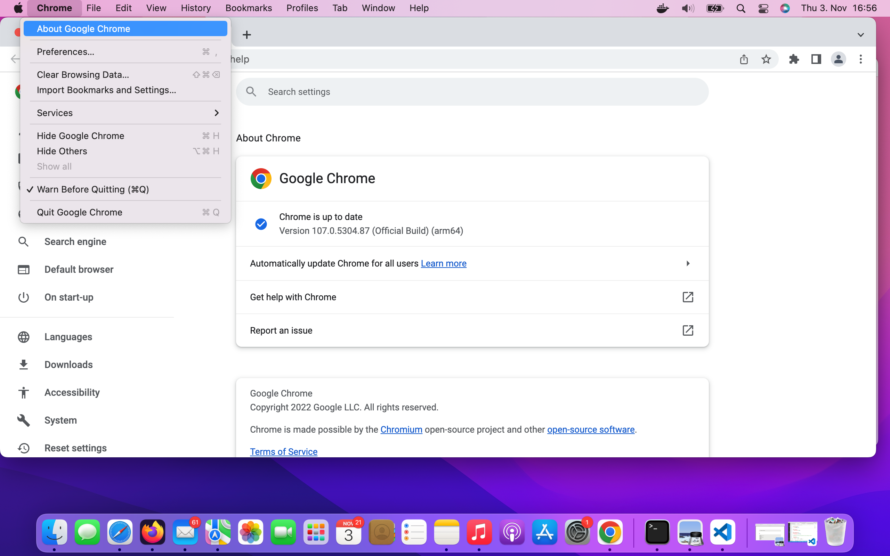
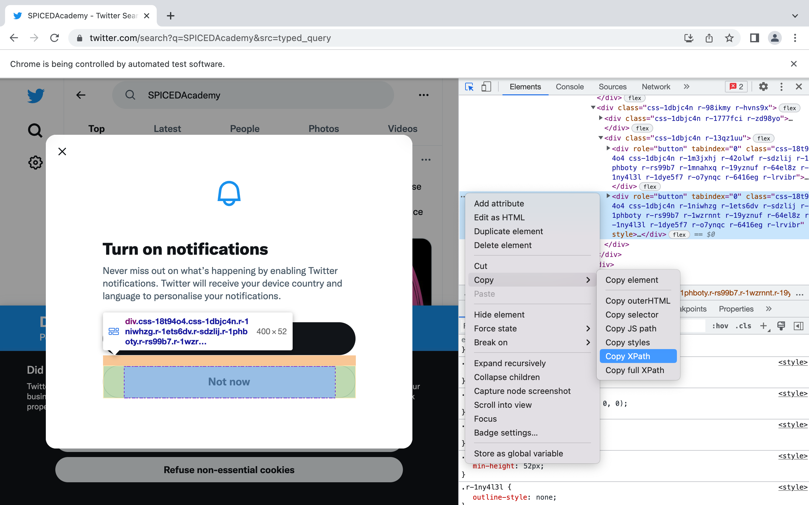

Web Browser Scraping with Selenium
==================================

.. figure:: selenium.jpg
   
*Photo by Malith Karunarathne on Unsplash*

.. container:: banner warmup

    Request

.. highlights::

    - What does your browser display when you click `here <https://twitter.com/search?q=SPICEDAcademy&src=typed_query&f=top>`_?
    - Complete, run the code in :download:`send_request.py` and answer the following question:

      - What is the status of the response?

      - Does the response content correspond to what displayed by your browser?

Selenium
--------
It is a tool that allows us to control web browsers 
and therefore making it possible to automate browser web-scraping.

Why Selenium
^^^^^^^^^^^^
So far we have been scraping the content from a static website, 
that has the advantage that we get all the information we are looking for. 
What would happen if we try to scrape a website, 
whose content is *dynamically* generated?
In this case we get back from the server a *Javascript* code.
This is exactly what we have got back from the server as a response when using **requests.get(url)**  in the warmup python script.
What is the *Javascript* code for? Well, it does not contain the webpage data but the instructions to generate it. 
These instructions are normally executed inside of the web browser (client) of a user.
This essentially means that the work to get the data is done on the client-side and not on the server-side, making it possible to scale up a web application while keeping the infrastructure relatively small.
As Selenium can *drive* a web browser, we can use it to get data even from a dynamic webpage.

Installation
^^^^^^^^^^^^
Execute the following command in your Git-bash/Terminal:

.. literalinclude:: selenium_installation.sh

We will use Selenium to drive Google Chrome. For this reason, we need do download the corresponding webdriver, e.g., chromedriver.
The webdriver is the program that Selenium will use to control the web browser. 
The following are the steps for downloading and installing chromedriver:

1. Check the version of the Google Chrome webbrowser as shown in the following figure

2. `Download <https://chromedriver.chromium.org>`_ the chrome webdriver corresponding to your Google Chrome webbrowser operating system of your computer
3. Execute the following commands in your Git-Bash/Terminal:  

.. literalinclude:: chromedrive_installation.sh

Web Scraping a Tweet
^^^^^^^^^^^^^^^^^^^^
The following steps demonstrate some of Selenium basic components. 
Open a jupyter notebook, copy each step code in individual cells and check what happen 
when you run one cell at the time.

Step 1: Start a Chrome Session
""""""""""""""""""""""""""""""

.. code-block:: python
   
   from selenium import webdriver
   from selenium.webdriver.common.by import By
   from selenium.webdriver.common.keys import Keys
   
   TWITTER_URL = "https://twitter.com"
   search_str = "SPICEDAcademy"

   browser = webdriver.Chrome()
   
The *browser* object controlls the Chrome Browser and makes it possible to simulate user actions. 

Step 2: Take Actions on a Browser
"""""""""""""""""""""""""""""""""

We can navigate to a web page.

.. code-block:: python
   
   browser.get(TWITTER_URL)

Step 3: Find a HTML element
"""""""""""""""""""""""""""

We can locate HTML elements by:

- CLASS_NAME
- CSS_SELECTOR
- ID
- LINK_TEXT
- NAME
- TAG_NAME
- XPATH

.. code-block:: python
   
   search_box = browser.find_element(by=By.TAG_NAME , value="input")

Step 4: Take actions on HTML elements
"""""""""""""""""""""""""""""""""""""

We can write text into the search box.

.. code-block:: python

   search_box.send_keys(search_str)

We can perform "ENTER" keyboard action.

.. code-block:: python

   search_box.send_keys(Keys.ENTER)

Step 5: Close pop-up windows
""""""""""""""""""""""""""""

.. code-block:: python

   not_now_button = browser.find_element(
      by=By.XPATH, 
      value='//*[@id="layers"]/div[2]/div/div/div/div/div/div[2]/div[2]/div/div[2]/div/div[2]/div[2]/div[2]/div'
      )
   not_now_button.click()

XPath is an XML (`Extensible Markup Language <https://developer.mozilla.org/en-US/docs/Web/XML/XML_introduction>`_) path, that we can use to navigate through the HTML structure of a web page. 
As shown in the following figure, to obtain the XPath for the *Not now* button in the notification box we need to:

* Open Chrome Developer Tools
* Find the html element corresponding for the *Not now* button
* Right-click on our Mouse
* Copy the XPath

Step 6: Get text of HTML elements
"""""""""""""""""""""""""""""""""

.. code-block:: python

   top_tweet = browser.find_element(
    by=By.XPATH,
    value='//*[@id="react-root"]/div/div/div[2]/main/div/div/div/div/div/div[3]/div/section/div/div/div[1]/div/div/article'
   ).text

Advanced Selenium tools
=======================

While web-browser scraping a page, 
we need to make sure that the browser has completely loaded 
the HTML elements we want to scrape. To this aim, we can employ a code that explicitly 
waits until a certain condition is satisfied. 
Selenium provides us with plenty of methods for implementing expected conditions. 
For an exaustive list, see the *Explicit Waits* link below in the reading section.

The code in ::download:`selenium_first_script.py` combines the prevoius steps and implement *explicit waits*.

.. container:: banner reading

   Links

.. highlights::

   -  `Static Vs Dynamic Website <https://www.geeksforgeeks.org/static-vs-dynamic-website/>`__
   -  `Selenium <https://www.selenium.dev/documentation/webdriver/>`__
   -  `Explicit Waits  <https://selenium-python.readthedocs.io/waits.html#explicit-waits>`__
   -  `Scrolling Web Pages with Selenium <https://www.selenium.dev/documentation/webdriver/actions_api/wheel/>`__

